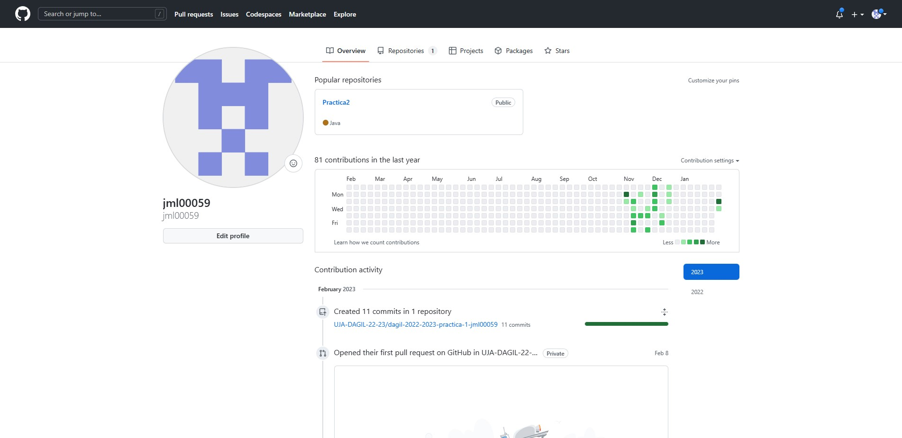
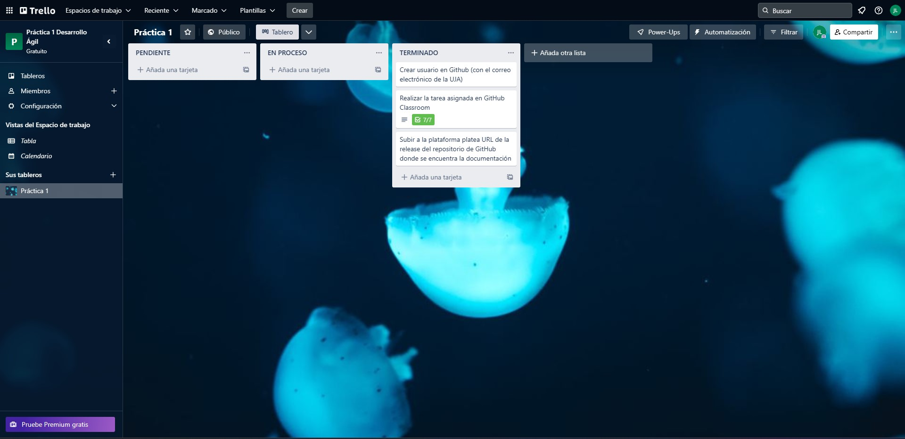

Aquí se encuentra todo lo necesario a la documentación:

-Nombre del alumno: Javier Martínez López

* **Correo**: jml00059@red.ujaen.es
* **GitHub**: https://github.com/jml00059
* **Trello**: https://trello.com/u/javiermartinezlopez9

-Captura de pantalla al principio de trello:

-Captura de pantalla de pagina de github:

-Captura de pantalla final de Trello:

